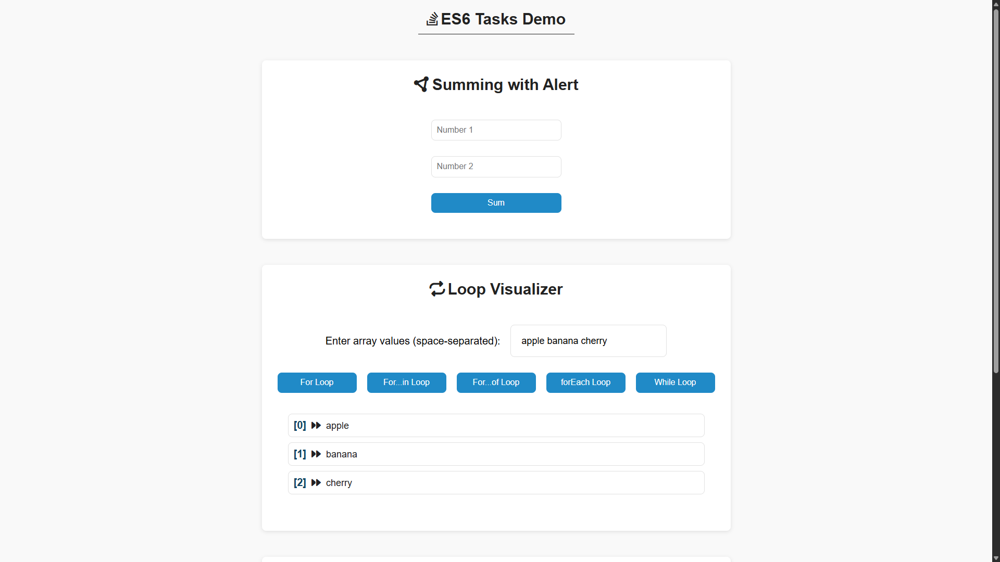

# 📚 ES6 Training Tasks

A collection of practical tasks and exercises demonstrating modern **JavaScript ES6+** features.  
This project is perfect for beginners and intermediate developers aiming to strengthen their JavaScript fundamentals using **variables, functions, loops, arrays, classes**, and more.

---

## 🚀 Live Demo

📍 [View Live](https://codebyabdo.github.io/ES6-Tasks/)

---

## 📦 Repository

🔗 [GitHub Repo](https://github.com/codebyabdo/ES6-Tasks)

---

## 📸 Screenshot

| Page one | page two |
|-----------|------------------|
|  |  |


---

## ✨ Features

- ✅ Hands-on practice with modern **JavaScript (ES6+)**
- 🧠 Covers core concepts like:
  - `let`, `const`, arrow functions
  - Template literals
  - Destructuring
  - Spread and Rest operators
  - Classes & Inheritance
  - Modules (import/export)
- 🔁 Array methods: `map()`, `filter()`, `reduce()`, etc.
- 🧪 Clean, commented code for each task
- 📂 Organized structure with separate files for each concept

---

## 🛠 Tech Stack

- **JavaScript (ES6+)**
- **HTML5**
- **CSS3**

> 📌 No external libraries or frameworks – Just pure JS & DOM manipulation

---

## 📁 Project Structure

```
ES6-Tasks/
├── index.html         # HTML structure for the app
├── css/
│   ├── style.css      # Main styling file
│   ├── all.min.css    # FontAwesome icons
│   └── normalize.css  # Normalize default browser styles
├── js/
│   └── script.js      # Contains all JavaScript logic for the tasks
└── README.md          # Documentation (this file)
```

---

## 📄 License

This project is licensed under the [MIT License](./LICENSE).

---

## 🙋‍♂️ Author

- [Abd El-Rahman Adel](https://github.com/codebyabdo)
- [LinkedIn](https://www.linkedin.com/in/codebyabdo)

---

> ⭐ Feel free to fork the repo, use the code for learning, and give it a ⭐ if you find it helpful!
